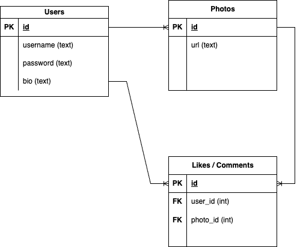

# unit-7-project-week-rollout

## Purpose

The main purpose of this project is to practice building a CRUD Express app (PostgreSQL database, Node.js + Express.js Server, Knex.js) with a front-end for interacting with the app.

## Requirements

**If you are working in a pair**, your app's Minimum Viable Product (MVP) is expected to have:

- At least 3 tables in your app's database
- At least 1 many-to-many relationship in your app.

**If you working alone**, your app's Minimum Viable Product (MVP) is expected to have

- At least 2 tables in your app's database
- At least 1 one-to-many or many-to-many relationship in your relationship.

**Every group must have:**
- An Entity-Relationship Diagram (ERD) accurately illustrating your final app's data architecture (schema)
First Draft during planning, Final Draft for presentation
- A wireframe (hand-drawn is fine) illustrating the key interactable components in your UI (anything that triggers a fetch) 
- A model with full CRUD capability
- An express API
- A front end to interact with the API
- A demo + presentation slides to showcase your project

## Project Ideas
There any many simple app ideas that would fit nicely into these requirements. For example, a Personal To Do List would have a Users table and a ToDos table. A user would be able to create an account, sign in, and keep track of their ToDos. However, so many bootcamp students build a basic To Do List as part of their portfolio.

So, it is perfectly acceptable (and even encouraged) to build a clone of an existing app. Here are some ideas:

#### Group Project Ideas

- AirBnb (Users, Listings, Bookings)
- Instagram (Users, Posts, Comments)
- Twitter (Users, Tweets, Likes)
- Uber (Riders, Rides, Drivers)
- Blogging App (Users, Blogs, Comments)
- Healthcare App (Patients, Appointments, Doctors)
- Social Network (Users, Connections) 

#### Solo Project Ideas

- Personal Blogging Site (Users, Blogs)
- Personal Photo Gallery (Users, Photos)
- Fitness Tracker (Users, Workouts)
- Nutrition Tracker (Users, FoodItems)
- Simple Video Game (Users, Scores)

#### Challenge Projects

The following projects are a bit more challenging because they have _two_ types of users.

- Uber (Riders, Rides, Drivers)
- Healthcare App (Patients, Appointments, Doctors)

## Example ERD

Your project is expected to have Users and a primary resource that each user "has" (photos, posts, recipes, etc). Group projects should also have a secondary resource that forms a many-to-many relationship between users and their primary resource. 

The ERD below illustrates these relationships in a Twitter clone application.

## Deliverables

| Due Date | Deliverable |
| - | -
| Day 1 | Project Idea + ERD |
| Day 2 | GitHub repo with committed Knex migration and seed files |
| Day 2 | GitHub repo with committed CRUD-capable model |
| Day 3 | GitHub repo with committed Express server that responds 'Hello World' to 'GET /' requests |
| Day 4 | GitHub repo with committed controllers as route handlers to interact with the model for GET, POST, PATCH, and DELETE requests
| Day 4 | Wireframe (hand drawn is fine) of essential front end components along with descriptions of components that trigger fetch requests (include the url, request method type,related body data)
| Day 5 | GitHub repo with committed Auth Handling |
| Day 6 | Githbu repo with committed HTML/JS including elements that trigger fetch requests |
| Day 7 | GitHub repo with committed CSS styling |
| Day 8 | Project demo with presentation |
