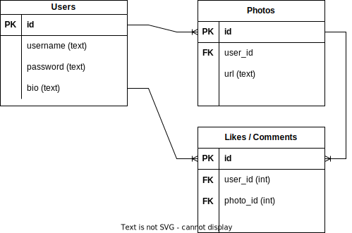

# unit-7-project-week-rollout

## Purpose

The main purpose of this project is to practice building a CRUD Express app (PostgreSQL database, Node.js + Express.js Server, Knex.js) with a front-end for interacting with the app.

## Requirements

**If you are working in a pair**, your app's Minimum Viable Product (MVP) is expected to have:

- A **Users** table
- A **primary resource** table (e.g. photo posts, blog/forum posts, video posts, etc...) forming a **one-to-many** relationship.
- A **secondary resource** table (e.g. likes, comments, bookmarks) forming a **many-to-many relationship**.

**If you working alone**, your app's Minimum Viable Product (MVP) is expected to have

- A **Users** table
- A **primary resource** table (e.g. photo posts, blog/forum posts, video posts, etc...) forming a **one-to-many** relationship.

**Every group must have:**
- An Entity-Relationship Diagram (ERD) accurately illustrating your final app's data architecture (schema)
- A wireframe (hand-drawn is fine) illustrating the key interactable components in your UI (anything that triggers a fetch) 
- At least one model with full CRUD capability
- An express API
- A simple front end to interact with the API
- A demo + presentation slides to showcase your project

## Project Ideas
There any many simple app ideas that would fit nicely into these requirements. For example, a Personal To Do List would have a Users table and a ToDos table. A user would be able to create an account, sign in, and keep track of their ToDos. However, so many bootcamp students build a basic To Do List as part of their portfolio.

So, it is perfectly acceptable (and even encouraged) to build a clone of an existing app. Here are some ideas:

#### Group Project Ideas

- AirBnb (Users, Listings, Bookings)
- Instagram (Users, Posts, Comments)
- Twitter (Users, Tweets, Likes)
- Uber (Riders, Rides, Drivers)
- Blogging App (Users, Blogs, Comments)
- Healthcare App (Patients, Appointments, HealthProfessionals)
- Social Network (Users, Connections) 

#### Solo Project Ideas

- Personal Blogging Site (Users, Blogs)
- Personal Photo Gallery (Users, Photos)
- Fitness Tracker (Users, Workouts)
- Nutrition Tracker (Users, FoodItems)
- Simple Video Game (Users, Scores)

#### Challenge Projects

The following projects are a bit more challenging because they have _two_ types of users.

- Uber (Riders, Rides, Drivers)
- Healthcare App (Patients, Appointments, Doctors)

## Deliverables

| Due Date   (End of Day) | Deliverable |
| - | -
| Day 1 (Thursday) | Project Idea with 3 suggested tables|
| Day 2 (Friday) | ERD & Wireframe (hand drawn for both is fine).   - ERD should accurately represent relationships between tables.   - Wireframe should show only essential UI components that trigger fetch requests (include the url endpoint, request method type, related body data) |
| Day 3 (Monday) | GitHub repo with commits for Knex migration and seed files + Create and Read-capable `User` model |
| Day 4 (Tuesday) | GitHub repo with commits for Express API (routes / controllers) for interacting with the model + Auth registration and login w/ front-end form |
| Day 5 (Wednesday) | Github repo with commits for full CRUD features for primary resources (Users can create/read/update/delete a tweet, post, blog, etc.).   - Solo projects should have create/read capabilities for primary resource. |
| Day 6 (Thursday) |  MVP is reached - Github repo with commits for creating a secondary resource (like, comment, etc.)   - Solo projects should have full CRUD capabilities for primary resource. |
| Day 7 (Friday) | GitHub repo with committed CSS styling |
| Day 8 (Monday) | Project demo with presentation & final ERD|
